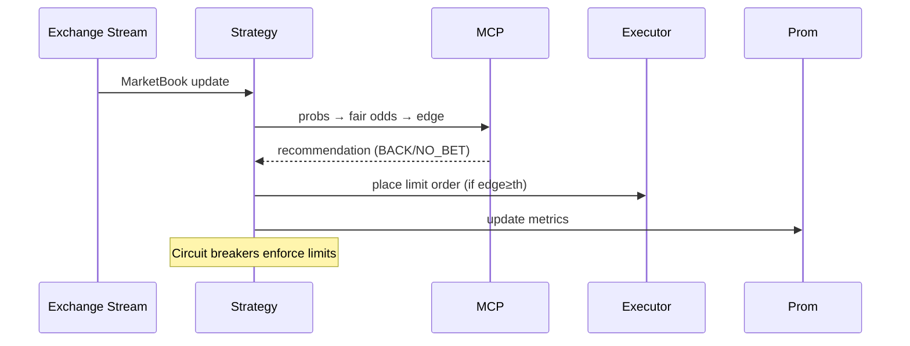
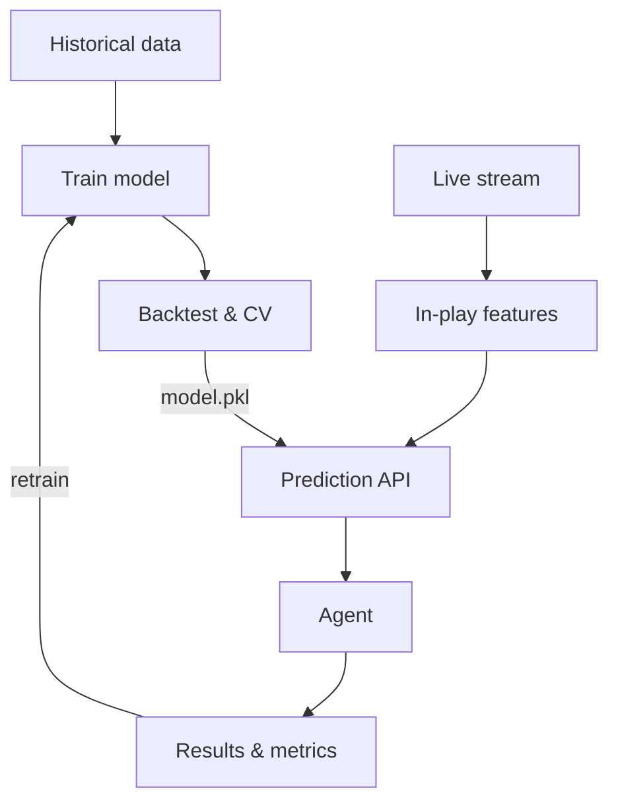

# AI/ML Construction — Explained for Everyone

## For a small child (5–7)
Imagine two players are racing. We try to guess who will win by looking at how fast they usually run. If the shop says **Alice wins** pays **2 candies for 1**, and we think Alice should pay **3 candies for 1** (because she is very strong today), then the shop is giving us a **good deal**. We take a small candy bet. If the deal is not good, we wait.

## For a bigger child (8–12)
We turn **chances** into **fair prices**. If we think a player has a 60% chance to win, the fair price is `1 / 0.6 = 1.67`. If the market offers **2.0**, that’s better than fair (extra value). We only bet when value is big enough (say **+5%**). We also control how much we risk with a rule called **Kelly** so we don’t lose too much at once.

## For mum & grandmom
We run a program that watches the live odds feed. Our model estimates each player’s win probability. From that, we compute a fair price and compare to the market’s price in real time. When the market is sufficiently generous, we place a small, sized bet. We record all actions and results, and dashboards show profit, return, and risk so you can see it’s safe and controlled.

## For engineers (technical)
- **Inputs**: live prices from the Betfair **Exchange Stream API**; optional model probabilities from a REST **Prediction API**. citeturn0search3  
- **Model → Price**: `fair_odds = 1 / p`. **Edge** = `(market_back - fair) / fair`.  
- **Decision**: if `edge ≥ threshold`, place a `BACK` limit order at best available price.  
- **Stake sizing**: capped **Kelly** fraction `f* = (b*p - (1-p)) / b`, where `b = odds - 1`; `stake = bankroll * min(f*, max_risk_pct)`.  
- **Execution**: strategy loop in **flumine**; SIM mode uses **paper trading** for safe shadow runs. citeturn0search0  
- **Observability**: Prometheus metrics (`/metrics`) scraped via **ServiceMonitor**; alerts via **PrometheusRule**; Grafana dashboard from ConfigMap. citeturn0search21turn0search5

## Pictures (Mermaid)

### Agent loop

### ML lifecycle (future)

## Verification & Validation

**Offline (before money)**
- **Backtests**: replay historical odds/settlements to verify profitability and variance.  
- **Calibration**: check if predicted probabilities match actual frequencies (Brier/ECE).  
- **Ablations**: show that value threshold and Kelly cap reduce drawdowns.

**Online (live, safe)**
- **SIM shadow**: paper trade for ≥24h; monitor **ROI** and **P/L**. citeturn0search0  
- **A/B**: small stake REAL vs SIM; promote only if REAL beats baseline over sufficient matches.  
- **Alerting**: trip stop‑loss quickly; pause & investigate.
