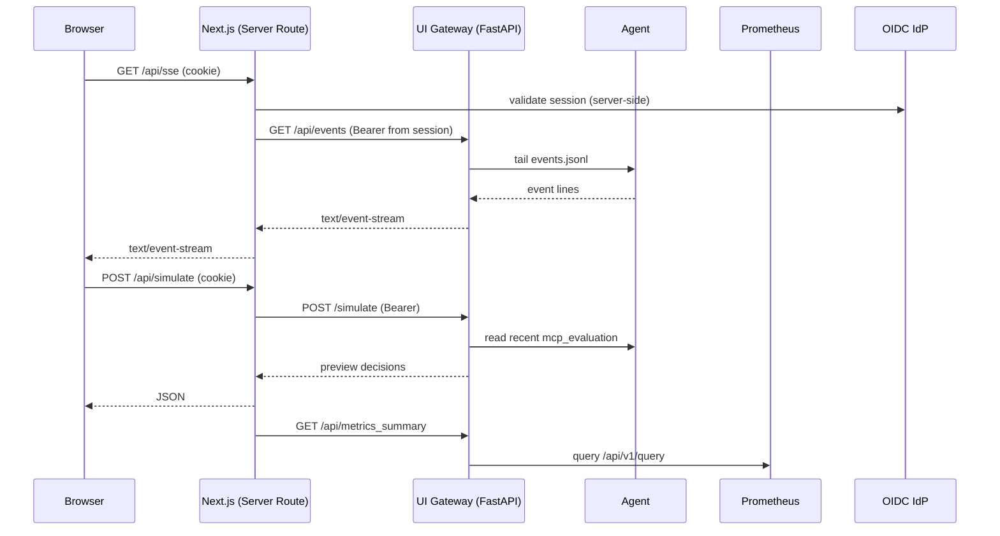

# Architecture — Advanced View

This page adds **deployment**, **security**, **scaling**, and **failure-mode** views on top of the big picture.

## Deployment (Kubernetes / OpenShift)
```mermaid
flowchart LR
  subgraph Namespace
    A[Agent Pod (Flumine + MCP)] -->|/metrics| P[Prometheus]
    A -->|/events JSONL| G[UI-Gateway Sidecar]
    G -->|/api/events, /simulate| UI[Next.js UI (separate Pod)]
    P --> Gr[Grafana]
  end
  UI --> Ingress["Ingress/Route + TLS"]
  UI -- OIDC --> IdP[(Auth0/Keycloak)]
  classDef k8s fill:#1f2937,stroke:#374151,color:#e5e7eb
  class Namespace,Ingress k8s
```

**Key:** The UI **proxies** `/api/sse`, `/api/simulate`, and `/api/metrics_summary` so **tokens remain in cookies**.

## Security/Data-flow


## Scaling & Availability
- **Horizontally scale UI** (stateless). SSE proxy is light; consider sticky sessions if needed.
- **Scale Agent**:
  - One agent per competition (shard markets) to avoid duplicate orders.
  - Use **leader election** or partition by market id hash.
- **Storage**: switch events JSONL to a lightweight queue (e.g., NATS/Redis Stream) for multi-agent fan‑in.
- **Resilience**: circuit breakers (stop‑loss), health checks, retry on IdP/Prom outages.

## Failure Modes & Mitigations
- **IdP down** → cached session or read-only mode (no new bets).
- **Prom down** → UI hides metrics; agent continues.
- **Exchange stream stalls** → watchdog; reconnect; halt orders when stale.
- **Prediction API down** → fallback to baseline probs; raise alert.
