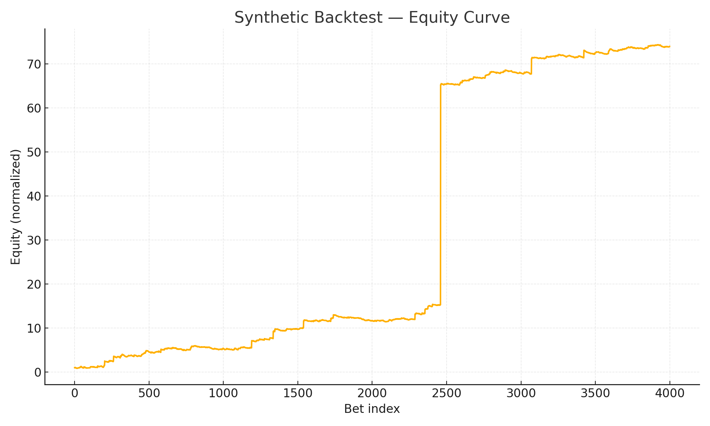
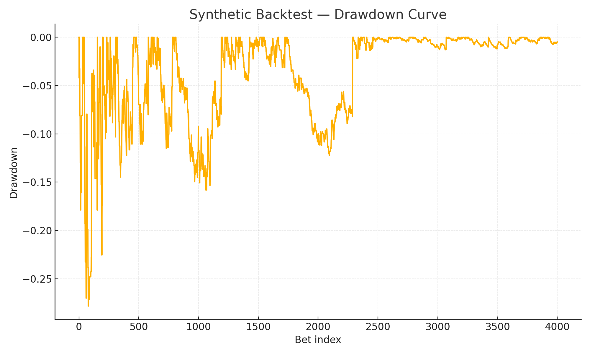
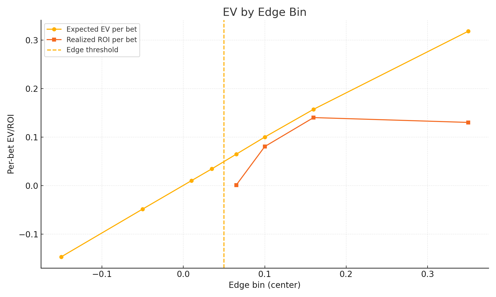

# Synthetic Backtest — Equity, Drawdown, and EV by Edge Bin

We simulate a simple market/model to illustrate expected vs realized behavior when betting only when **edge ≥ τ**.

- **Equity curve** — cumulative normalized bankroll.
- **Drawdown curve** — peak‑to‑trough losses over time.
- **EV by edge bin** — expected EV vs realized ROI per bet across edge buckets.

**Takeaways**
- Higher edges tend to map to higher EV (but with noise).
- Drawdowns are inevitable; use stop‑loss and exposure caps.
- Choose a conservative threshold τ to balance **coverage** and **quality**.
