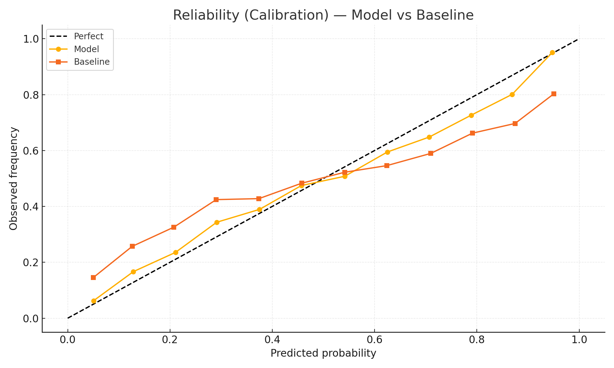

# Calibration — Model vs Baseline (Same Axes)

We compare **our model** against a **baseline** in a single reliability plot.
Curves closer to the diagonal indicate **better calibration** (predicted probabilities match observed frequencies).

**Why this matters:** Calibrated probabilities reduce false edges and stabilize stake sizing.
