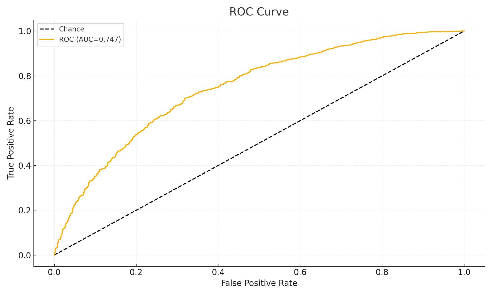

# Calibration Demo — Reliability, ROC, and PR Curves

This page shows how to **assess probability quality** and discrimination using a small synthetic example.

We generate a toy dataset of **predicted probabilities** and **true outcomes**, then produce:
- **Reliability (calibration) curve** — do predicted probabilities match observed frequencies?
- **ROC curve (AUC)** — ranking quality.
- **Precision–Recall curve (AUC)** — especially relevant for class imbalance.

## How to read these plots
- **Reliability**: line near the diagonal = well-calibrated; above it = under-confident; below = over-confident.
- **ROC**: closer to top-left is better; **AUC** ∈ [0.5, 1.0].
- **PR**: higher precision for a given recall is better; area summarizes performance when positives are rare.

> In our betting context, **calibrated probabilities** make edge detection and stake sizing **more reliable**.
