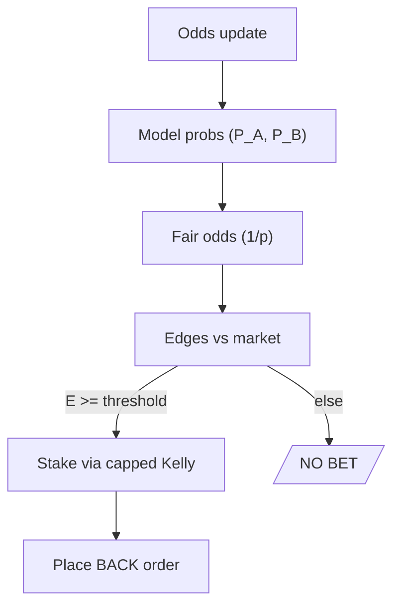

# MCP & Strategy

## Elevator pitch
Estimate **win probabilities**, compute **fair odds**, compare to **market odds**, place bets when **edge ≥ threshold**, size stakes with **capped Kelly**, and **observe everything**.

## Explain like I'm five (ELI5)
Imagine a smart friend who guesses how likely each player is to win. If the website's prize looks **too generous** compared to that chance, the friend says: *bet a **small** amount*. Otherwise: *wait*.

## Explain for adults
We convert model probabilities to **fair odds** (1/p). When the market offers odds better (higher) than fair by a margin (**edge**), it's a value bet. We only act if edge ≥ threshold and we cap stake size to protect the bankroll.

## For engineers
Let \(P_A\) and \(P_B\) be model win probabilities, \(O_A\), \(O_B\) the best back prices.
- Fair odds: \(F_A = 1/P_A\), \(F_B = 1/P_B\).
- Edge (odds form): \(E_A = (O_A - F_A)/F_A\), \(E_B = (O_B - F_B)/F_B\).
- Act when \(E\_{side} \ge \tau\) and \(O\_{side}\in[O_{min}, O_{max}]\).
- Stake (capped Kelly): \(f^* = \min(\max( (b p - (1-p))/b, 0), f_{max})\), where \(b=O-1\).

