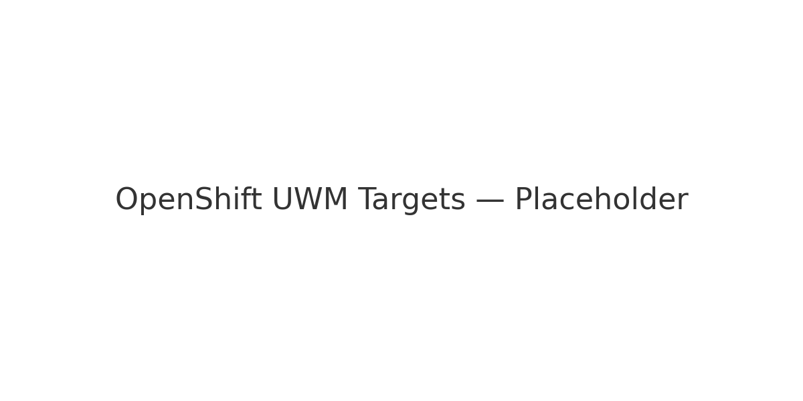
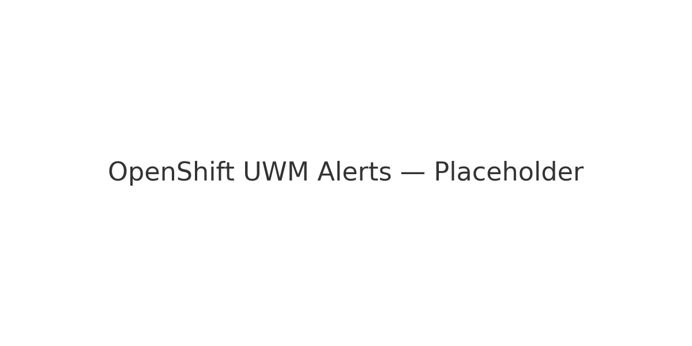
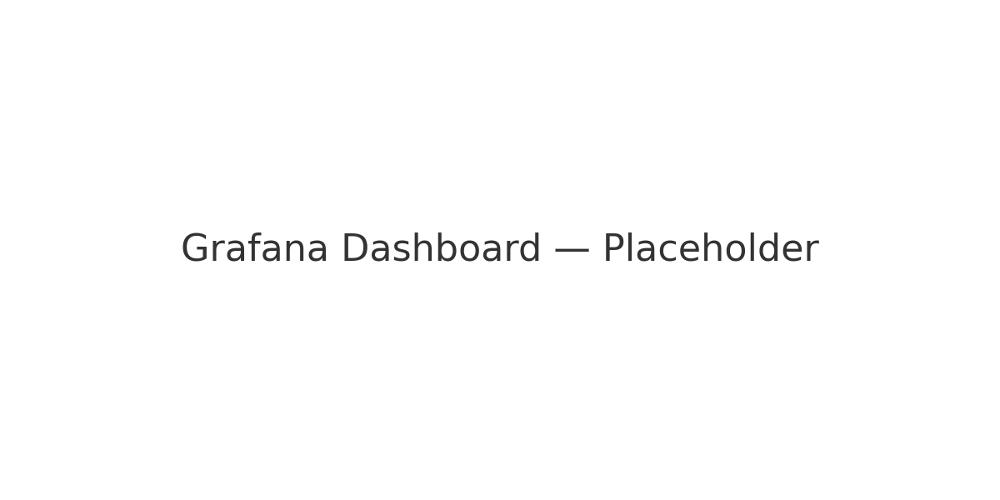

# OpenShift User Workload Monitoring (UWM) — Screenshots & Checklist

Use OpenShift **UWM** to scrape app metrics in your project namespace.

## Checklist
1. **Enable UWM** in your cluster (cluster admin setting).
2. Deploy this chart; ensure **ServiceMonitor** and **PrometheusRule** CRDs exist.
3. Verify targets:
   - OpenShift Console → *Observe → Targets* (Developer or Administrator view)
   - Look for `tennis-agent` ServiceMonitor target.
4. Verify rules & alerts:
   - *Observe → Alerts*: check `AgentDailyStopLossBreached`, `AgentNoData`, `AgentHighExposure`.
5. Dashboards:
   - Import `grafana/dashboards/agent.json` into Grafana (if not auto-discovered via ConfigMap label).

## Sample Screens (placeholders)

> Replace these placeholders with your actual screenshots once deployed.
