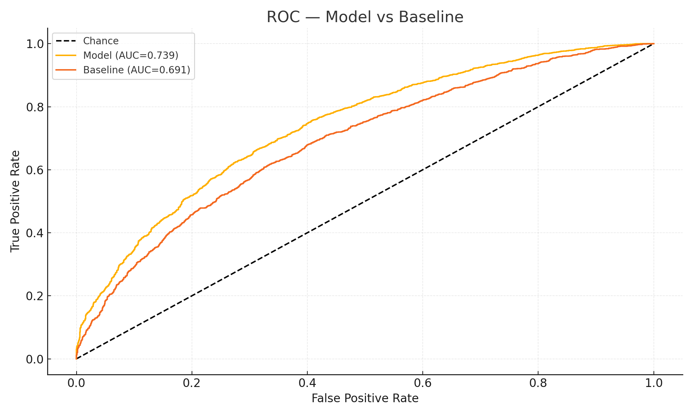
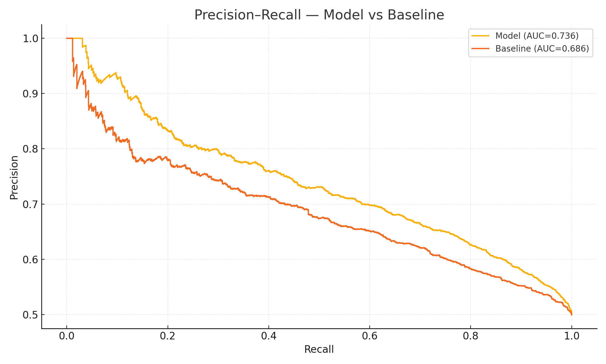

# ROC/PR — Model vs Baseline

We compare **discrimination** of the model vs a baseline using **ROC** and **Precision–Recall** curves.

- **ROC AUC** captures overall ranking quality.
- **PR AUC** is informative under class imbalance.

