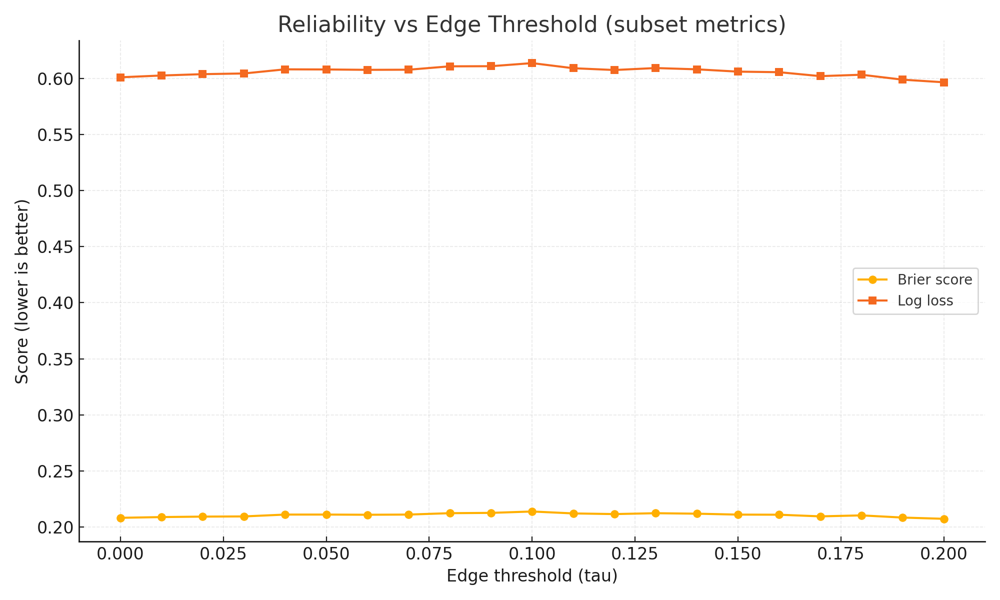
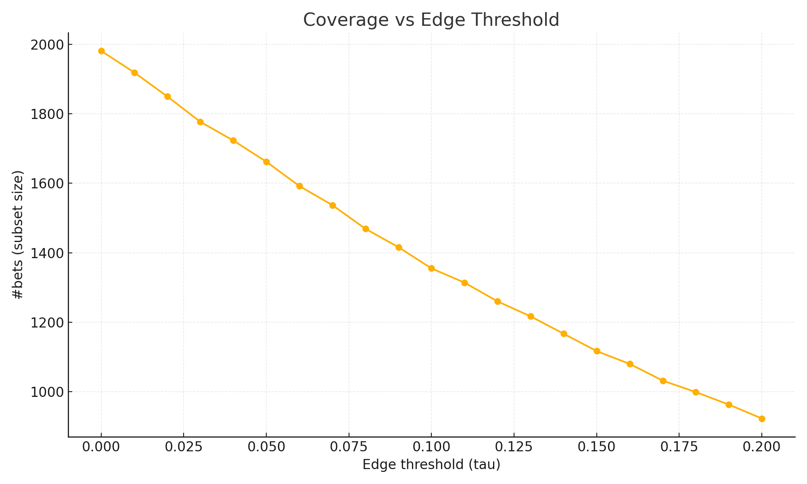

# Threshold Sensitivity — Reliability vs Edge Threshold

We evaluate **probability quality on the subset we actually bet**, as we raise the **edge threshold** \(\tau\).

- Metrics computed **only on predictions with edge ≥ \(\tau\)**.
- **Lower** Brier and Log loss indicate **better calibration** on the traded subset.
- Coverage drops as \(\tau\) increases (fewer bets).

> Use this chart to pick a conservative \(\tau\) that balances **quality** and **coverage**.
