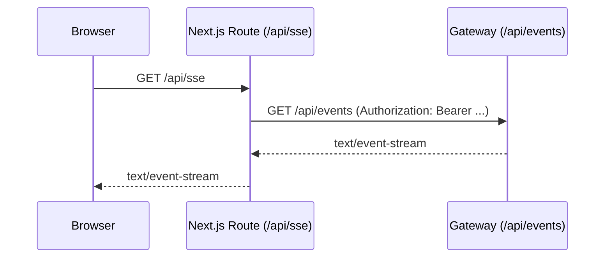

# UI & Gateway

The UI centers the **MCP interaction**: players, fair odds, probabilities, edge, and the live recommendation — with sliders to preview decisions.

- **SSE**: streamed via `/api/sse` proxy.
- **Simulate**: posted via `/api/simulate` proxy (tokens stay in cookies).
- **Metrics**: polled via `/api/metrics_summary` proxy.

