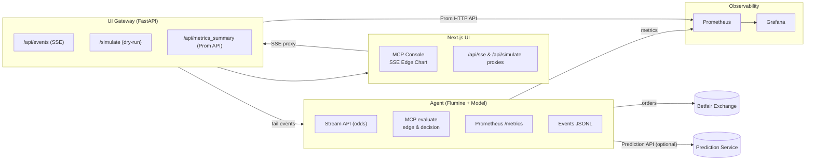

# Architecture (Big Picture)

**Why this design?**

- The **UI** uses server-side proxies so tokens live in cookies (no secrets in the browser).
- The **Gateway** unifies live streaming (SSE), simulation previews, and metrics.
- The **Agent** stays focused on market + model logic, emitting events & metrics.
- **Prometheus/Grafana** provide transparent, real-time observability.
