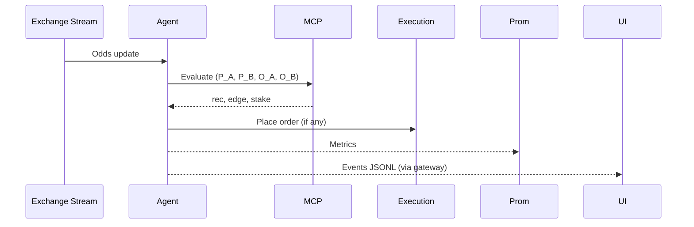

# Diagrams

## Agent Event Loop

```mermaid
sequenceDiagram
  participant Stream as Exchange Stream
  participant Agent
  participant MCP
  participant Exec as Execution
  Stream->>Agent: Odds update
  Agent->>MCP: Evaluate (P_A, P_B, O_A, O_B)
  MCP-->>Agent: rec, edge, stake
  Agent->>Exec: Place order (if any)
  Agent-->>Prom: Metrics
  Agent-->>UI: Events JSONL (via gateway)
```
