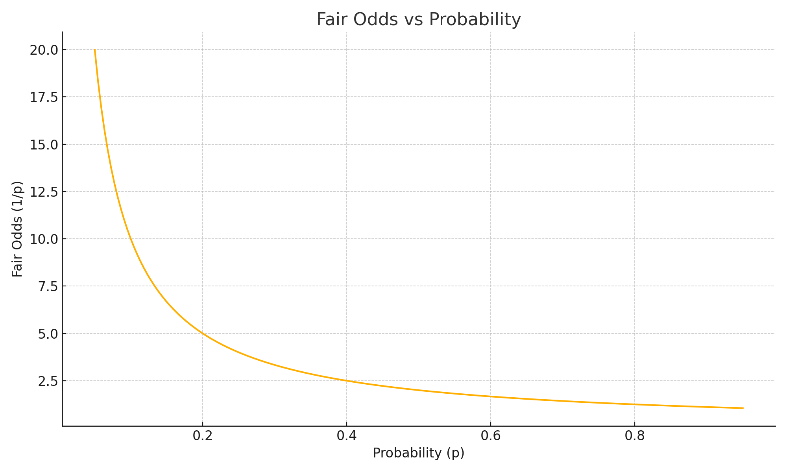

# Machine Learning — The Basics

**What is ML?** Teaching computers to **learn patterns from data** and make predictions.

**In our case:** Input features (player ratings, form, surface, H2H, etc.) → **probability** of Player A winning.

## Core concepts
- **Features**: numeric signals (ELO, recent wins, serve stats).
- **Label**: match outcome (A wins = 1, else 0).
- **Training**: adjust model parameters to minimize error (e.g., log loss).
- **Validation**: test on unseen matches to estimate generalization.
- **Calibration**: ensure predicted probabilities match observed frequencies.

## Pictures

